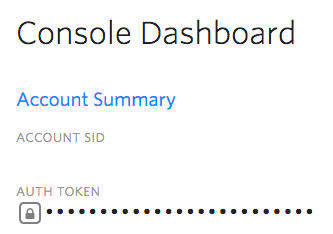
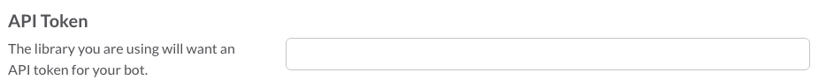
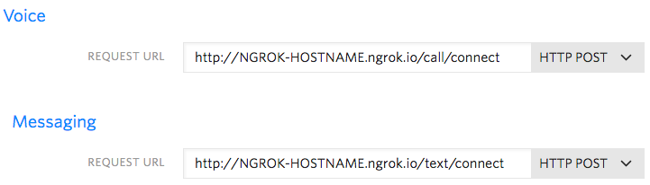

# ClientConnect

[View ClientConnect on Heroku!](http://client-connect.herokuapp.com/)

## Overview

ClientConnect is a platform for connecting with potential incoming clients. [Need to write more copy]

## Dependencies

* Ruby 2.2.3
* Rails 5.0.0.rc1

## Setup

  1. [Create Twilio Number and TwiML App](#create-twilio-number-and-twiml-app).
  2. [Create Slack Bot](#create-slack-bot)
  3. [Set Up App Locally](#set-up-app-for-local-development)
  4. [Add URLs to TwiML App](#add-urls-to-twiml-app)
  5. [Check Out the App!](#check-it-out)

### Create Twilio Number and TwiML App

  1. For this app to work, you will need to purchase a new [Twilio Programmable Voice and SMS](https://www.twilio.com/voice) number.
  2. Add the following environment variables from your Twilio account to your `application.yml` file:

  ```
  TWILIO_ACCOUNT_SID: your account sid
  TWILIO_AUTH_TOKEN: your auth token
  TWILIO_PHONE_NUMBER: your twilio phone number
  ```

  

  3. Create a new [TwiML App](https://www.twilio.com/user/account/apps/add). We will configure the Voice and Messaging request URLs after our app has been [set up locally](#set-up-app-for-local-development).
  4. Add the following environment variables to your `application.yml` file:

   ```
   TWIML_APPLICATION_SID: your twiml app sid
   ```

   

### Create Slack Bot

  [Slack Custom Integration](https://slack.com/apps/build/custom-integration) > Bots

  1. Create a new Slack Bot. Give it any name you'd like, such as `@client-connect-bot`.
  2. Invite the bot to the Slack channel that you'd like your incoming leads to post to (or create a new channel).

    ```
    /invite @YOUR-BOT-NAME
    ```

  3. Add the following environment variables to your `application.yml` file:

    ```
    SLACK_API_TOKEN: your slack bot API token
    SLACK_CHANNEL: slack channel that bot messages will post to
    ```

    

### Set Up App for Local Development

  1. Install dependencies
  
     ```
     bundle install
     ```
  2. Create database, run migrations, seed database (if desired):
  
     ```
     rake db:create db:migrate db:seed
     ```
  3. Make sure tests pass:

    ```
    bundle exec rspec
    ```
  3. Run the server:
  
     ```
     rails s
     ```
  4. We will need to make the server of this app publicly accessible, using [ngrok](https://ngrok.com/). Once you have installed ngrok, run:

     ```
     ngrok http 3000
     ```

### Add URLs to TwiML App

  1. Once you have started ngrok, update the [TwiML App's](https://www.twilio.com/console/voice/dev-tools/twiml-apps/) Voice and Messaging Request URLs to use your ngrok hostname:
    ```
    VOICE: http://YOUR-NGROK-HOSTNAME.ngrok.io/call/connect
    MESSAGING: http://YOUR-NGROK-HOSTNAME.ngrok.io/text/connect
    ```

    

### Check It Out!
  The app is now ready to accept incoming calls and texts!

  ```
  http://localhost:3000
  ```
